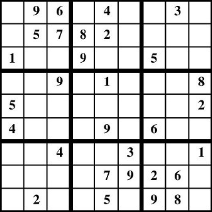

# Sudoku Solver

### Implementation of Arc Consistency

#### To Run

1. Navigate to root level directory of project
2. Run **ant all**
3. Run **run.bat**

#### Using the Sudoku Solver

Unfortunatly, it can take a minute to input the sudoku problem but once all the fields are in, press 'Solve'. Simple as that!

>Solve - will use Arc Consistency then solve what's left.
 
>Clear - will clear the board.
 
>Brute - will brute force solve the sudoku problem without Arc Consistency.

#### How does it work?

Arc Consistency is a common method in AI to solve a **Satisfaction Constraint Problem (CSP)** by eliminating possibilities that are impossible.  

For Sudoku specifically, each space has a domain of values that it is allowed to be {1...9}. Each space also has a constraint where it must contain a different number from every other space in the same 3x3 box, row, or column. 

The job of Arc Consistency is to iterate through each space to reduce the values in it's domain by checking that against the values in the domains for the boxes in the box, row, and column. For each domain value, there must exist at least one value in another related space's domain that's valid. Invalid domain values are removed until each space's domain is reduced as much as possible. This is done in

Observe the puzzle below...

The domain of the upper left space starts out as **D:{1..9}** but the constraint relationships to the spaces in the same column, row, and box mean that it can't be 9, 6, 5, 7, 1, 4, or 3. This makes the upper left space's domain as **D:{2, 8}**. 

When a domain of a space is reduced, all relationships to that space are readded to a queue to be evaluated again. When a space's domain consists of 1 value, the space is assigned that value. 

Often, Arc Consistency will not solve the puzzle completely and it must be completed by some sort of back tracking algorithm.

##### Credits:
SudokuGrid.java and SudokuUI.java were optainted through a course at Oklahoma Christian University.

Example from https://www.memory-improvement-tips.com/printable-sudoku-puzzles-easy-1b.html